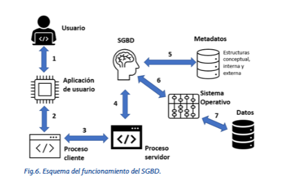

# Tema 3 — Sistemas Gestores de Bases de Datos (SGBD)

---

## Índice

1. [Introducción](#1-introducción)
2. [Definición, funciones y objetivos](#2-definición-funciones-y-objetivos)
3. [Arquitectura ANSI/X3/SPARC](#3-arquitectura-ansix3sparc)
4. [Componentes de un SGBD](#4-componentes-de-un-sgbd)
5. [Tipos de SGBD](#5-tipos-de-sgbd)
6. [Funcionamiento paso a paso](#6-funcionamiento-paso-a-paso)
7. [SGBD vs ficheros clásicos](#7-sgbd-vs-ficheros-clásicos)
8. [SGBD distribuidos](#8-sgbd-distribuidos)
9. [Lenguajes de bases de datos](#9-lenguajes-de-bases-de-datos)
10. [SGBD libres y comerciales](#10-sgbd-libres-y-comerciales)

---

## 1. Introducción

Los SGBD nacieron en los **años 60** para manejar grandes volúmenes de datos en industrias como la aeroespacial y la automovilística. Estaban muy vinculados al hardware, lo que dificultaba su uso.

En los **años 80** llegó el gran cambio:
- Nace **Oracle** en 1980
- Se crea el lenguaje **SQL** en 1986
- Aparecen los SGBD relacionales que usamos hoy

En los **años 90** surge el concepto de bases de datos distribuidas. Hoy los SGBD siguen evolucionando hacia la nube y el Big Data.

> 💡 Un SGBD es el **intermediario** entre las aplicaciones y los datos. Sin él tendrías que gestionar los ficheros manualmente como se hacía antes.

---

## 2. Definición, funciones y objetivos

Un **SGBD** (Sistema Gestor de Bases de Datos) es una aplicación de software que facilita a los usuarios la **gestión y manipulación de los datos** en una base de datos, garantizando en todo momento su disponibilidad y seguridad.

```
  App 1       App 2       App 3
    \           |           /
     \          |          /
      ▼         ▼         ▼
    ┌─────────────────────────┐
    │          SGBD           │
    └─────────────────────────┘
                 │
                 ▼
         ┌──────────────┐
         │ BASE DE DATOS│
         └──────────────┘
```

### Funciones y objetivos principales

| Función | Descripción |
|---------|-------------|
| **Consultar y manipular** | Permite acceder, insertar, modificar y eliminar datos de forma eficiente |
| **Seguridad** | Gestiona permisos — cada usuario solo ve lo que le corresponde |
| **Concurrencia** | Varios usuarios pueden acceder a los mismos datos simultáneamente sin conflictos |
| **Integridad** | Garantiza que los datos son consistentes y correctos en todo momento |
| **Copias de seguridad** | Proporciona herramientas para hacer y restaurar backups |
| **Independencia** | Permite migrar a otro hardware o SO sin cambiar las aplicaciones |
| **Redundancia mínima** | Evita que el mismo dato esté duplicado en varios sitios |

---

## 3. Arquitectura ANSI/X3/SPARC

Los SGBD se organizan en **tres niveles** que separan lo que ve el usuario de cómo se almacenan realmente los datos. Este estándar se llama **ANSI/X3/SPARC**.

```
┌─────────────────────────────────────┐
│  NIVEL EXTERNO (vista del usuario)  │
│  Usuario A ve: nombre, email        │
│  Usuario B ve: nombre, salario      │  ← cada usuario ve lo suyo
└─────────────────┬───────────────────┘
                  │
┌─────────────────▼───────────────────┐
│  NIVEL CONCEPTUAL (estructura)      │
│  Tablas, campos, relaciones         │  ← lo que define el analista
│  Normas e integridad de los datos   │
└─────────────────┬───────────────────┘
                  │
┌─────────────────▼───────────────────┐
│  NIVEL INTERNO (almacenamiento)     │
│  Ficheros, índices, ubicación física│  ← lo que gestiona el DBA
│  Depende del hardware y SO          │
└─────────────────────────────────────┘
```

| Nivel | Quién lo gestiona | Qué contiene |
|-------|------------------|--------------|
| **Externo** | Programador / Usuario | La vista que cada usuario tiene de los datos |
| **Conceptual** | Analista | Estructura de tablas, campos, relaciones y normas |
| **Interno** | Administrador (DBA) | Cómo se guardan físicamente los datos en disco |

> 💡 El objetivo de estos tres niveles es conseguir la **independencia físico-lógica** — puedes cambiar cómo se almacenan los datos sin que los usuarios ni las aplicaciones lo noten.

---

## 4. Componentes de un SGBD

```
SGBD
│
├── Datos almacenados      → estructurados en ficheros internos
│
├── Lenguaje de programación → SQL y otros para acceder y manipular datos
│
├── Diccionario de datos   → metadatos: nombres de campos, tipos,
│                            restricciones, relaciones...
│                            Puede ser activo (se actualiza solo)
│                            o pasivo (actualización manual)
│
├── Utilidades y herramientas → gestión de usuarios, backups,
│                               estadísticas, informes...
│
├── Entorno gráfico        → interfaz visual para usuarios menos técnicos
│                            Ej: MySQL Workbench, pgAdmin
│
└── Usuarios
     ├── DBA (Administrador)   → instala, mantiene, optimiza y asegura el SGBD
     ├── Analista              → diseña la estructura de la BD
     ├── Programador           → desarrolla las aplicaciones que usan la BD
     ├── Operador              → soporte y resolución de incidencias
     └── Usuario final         → consulta y usa los datos del día a día
```

---

## 5. Tipos de SGBD

### Según el modelo lógico
Relacionales, orientados a objetos, objeto-relacionales, NoSQL... (los mismos modelos que hemos visto en el Tema 2)

### Según su tamaño

| Tipo | Características | Ejemplos |
|------|----------------|---------|
| **Ligeros** | Tamaño reducido, bajo consumo | Microsoft Access, LibreOffice Base, SQLite |
| **Alto rendimiento** | Grandes volúmenes, funcionalidades complejas | Oracle, MySQL, SQL Server, MongoDB |

### Según su arquitectura de ejecución

```
MONOCAPA                    BICAPA                      MULTICAPA
────────                    ──────                      ─────────
[Cliente]                   [Cliente]                   [Cliente]
[SGBD   ]  ← todo en        [  Red  ]                   [  Red  ]
[BD     ]    el mismo PC    [SGBD+BD]  ← cliente y      [Servidor intermedio]
                                         servidor       [  Red  ]
                                         separados      [SGBD + BD]
                                         
```

### Según la ubicación
Centralizados o distribuidos — igual que vimos en el Tema 2.

---

## 6. Funcionamiento paso a paso

¿Qué pasa entre que haces una consulta y recibes el resultado?




---

## 7. SGBD vs ficheros clásicos

¿Por qué usar un SGBD en vez de gestionar los datos con ficheros?

| Aspecto | Ficheros clásicos | SGBD |
|---------|------------------|------|
| **Espacio** | Datos duplicados en varios ficheros | Datos centralizados sin duplicidad |
| **Acceso simultáneo** | Conflictos si varios usuarios acceden a la vez | Gestión de concurrencia automática |
| **Búsqueda** | Difícil con grandes volúmenes | Eficiente con SQL |
| **Integridad** | Sin control — cualquiera puede meter datos incorrectos | Restricciones y validaciones automáticas |
| **Seguridad** | La del sistema operativo | Roles, permisos y cifrado |
| **Lenguaje** | Programación específica para cada app | SQL estándar combinable con Java, PHP... |

---

## 8. SGBD distribuidos

Un **SGBDD** realiza las mismas funciones que un SGBD centralizado pero gestionando datos repartidos en múltiples ubicaciones.

### Tres objetivos clave de transparencia

> ⚠️ El usuario **nunca debe notar** que la BD está distribuida:

```
Transparencia de red         → no sabe si los datos están en un servidor o en mil
Transparencia de fragmentación → no sabe si los datos están fragmentados
Transparencia de replicación  → no sabe si hay copias en varios nodos
```

### Problemas que debe resolver

- Sincronizar actualizaciones entre réplicas
- Gestionar transacciones distribuidas
- Recuperarse si falla un nodo
- Balancear la carga entre nodos
- Garantizar seguridad en todos los nodos

### Ejemplos de SGBDD
- **PrestoDB** — usado por Facebook, Netflix, AirBnB
- **Apache Cassandra**
- **MongoDB** (en modo distribuido)

---

## 9. Lenguajes de bases de datos

SQL se divide en cuatro tipos de sentencias según su función:

```
SQL
│
├── DDL — Data Definition Language
│    Crea y modifica la ESTRUCTURA de la BD
│    CREATE TABLE, ALTER TABLE, DROP TABLE
│
├── DML — Data Manipulation Language
│    Trabaja con los DATOS
│    SELECT, INSERT, UPDATE, DELETE
│
├── DCL — Data Control Language
│    Controla los PERMISOS de acceso
│    GRANT, REVOKE
│
└── TCL — Transaction Control Language
     Gestiona las TRANSACCIONES
     COMMIT, ROLLBACK
```

| Tipo | Sentencias principales | Para qué |
|------|----------------------|---------|
| **DDL** | `CREATE` `ALTER` `DROP` | Crear/modificar/eliminar tablas e índices |
| **DML** | `SELECT` `INSERT` `UPDATE` `DELETE` | Consultar y modificar datos |
| **DCL** | `GRANT` `REVOKE` | Dar/quitar permisos a usuarios |
| **TCL** | `COMMIT` `ROLLBACK` | Confirmar/deshacer operaciones |

> 💡 En esta asignatura trabajarás principalmente con **DDL** (Bloque 3) y **DML** (Bloques 4 y 5).

---

## 10. SGBD libres y comerciales

### Libres / Código abierto

| SGBD | Tipo | Características |
|------|------|----------------|
| **MySQL** | Relacional | El más usado en aplicaciones web. Multiplataforma. Oracle lo compró pero mantiene versión libre. **Lo usarás en esta asignatura.** |
| **MariaDB** | Relacional | Bifurcación de MySQL creada por sus desarrolladores originales. Compatible con MySQL. |
| **PostgreSQL** | Objeto-relacional | Muy avanzado. Código abierto. Gran volumen de datos. |
| **SQLite** | Relacional ligero | Sin servidor. Muy rápido. Ideal para apps móviles. |
| **MongoDB** | NoSQL | Documentos JSON. Diseñado para la nube. |

### Comerciales

| SGBD | Tipo | Características |
|------|------|----------------|
| **Oracle** | Objeto-relacional | El más potente y usado en grandes empresas. Lenguaje PL/SQL. Muy caro. **Lo usarás en el Bloque 6 y 7.** |
| **SQL Server** | Relacional | Microsoft. Lenguaje T-SQL. Bien integrado con Azure. |
| **DB2** | Relacional | IBM. Muy potente para automatización. |

### Comparativa rápida

| SGBD | Precio | Mejor para |
|------|--------|-----------|
| MySQL | Gratis | Apps web, proyectos medianos |
| PostgreSQL | Gratis | Proyectos grandes, datos complejos |
| SQLite | Gratis | Apps móviles, proyectos pequeños |
| Oracle | Muy caro | Grandes empresas, alto rendimiento |
| SQL Server | Caro | Empresas Microsoft |

---

## Resumen del tema

```
SGBD
│
├── Definición → intermediario entre apps y datos
├── Funciones  → consultar, seguridad, concurrencia,
│                integridad, backups
│
├── Arquitectura ANSI/X3/SPARC
│    ├── Externo   → vista del usuario
│    ├── Conceptual → estructura de tablas
│    └── Interno   → almacenamiento físico
│
├── Componentes → datos, lenguaje, diccionario,
│                 utilidades, entorno gráfico, usuarios
│
├── Tipos
│    ├── Por tamaño: ligeros / alto rendimiento
│    └── Por arquitectura: monocapa / bicapa / multicapa
│
├── SGBD vs ficheros → concurrencia, integridad,
│                      seguridad, SQL estándar
│
├── SGBDD → transparencia de red, fragmentación y replicación
│
├── Lenguajes: DDL / DML / DCL / TCL
│
└── SGBD libres: MySQL ✅, PostgreSQL, SQLite, MongoDB
    SGBD comerciales: Oracle ✅, SQL Server, DB2
```
